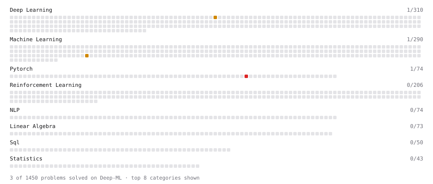

# Deep-ML

My machine learning practice from [Deep-ML](https://www.deep-ml.com). Every solution here was written by hand.

**5** solved · 5 problems · 0 labs · 0 math

[**Browse the interactive portfolio**](https://theBaoo.github.io/deep-ml/) to replay this filling in over time.

## Problems

| | Difficulty | Solved | |
| --- | --- | --- | --- |
| [Create a Float Tensor from a Python List](https://www.deep-ml.com/problems/880) | easy | 2026-10-01 | [solution](problems/0880-create-a-float-tensor-from-a-python-list) |
| [BIRCH Clustering for Large Datasets](https://www.deep-ml.com/problems/825) | medium | 2026-09-20 | [solution](problems/0825-birch-clustering-for-large-datasets) |
| [Dropout Layer](https://www.deep-ml.com/problems/151) | medium | 2026-09-28 | [solution](problems/0151-dropout-layer) |
| [Poisson Deviance and Overdispersion](https://www.deep-ml.com/problems/1367) | medium | 2026-09-29 | [solution](problems/1367-poisson-deviance-and-overdispersion) |
| [Trade Compute for Memory with Gradient Checkpointing](https://www.deep-ml.com/problems/1342) | hard | 2026-09-23 | [solution](problems/1342-trade-compute-for-memory-with-gradient-checkpointing) |

---

_This file is regenerated by Deep-ML on every push._
